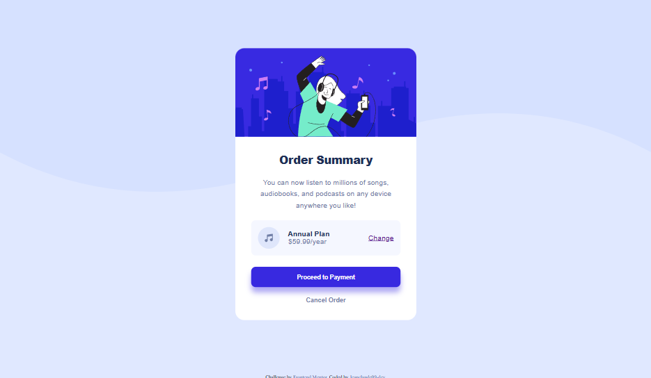

# Order-summary-component-main

# Frontend Mentor - Order summary card solution

This is a solution to the [Order summary card challenge on Frontend Mentor](https://www.frontendmentor.io/challenges/order-summary-component-QlPmajDUj). Frontend Mentor challenges help you improve your coding skills by building realistic projects.

## Table of contents

- [The challenge](#the-challenge)
- [Screenshot](#screenshot)
- [Links](#links)
- [Built with](#built-with)
- [What I learned](#what-i-learned)
- [Continued development](#continued-development)
- [Author](#author)

### The challenge

Users should be able to:

- See hover states for interactive elements

### Screenshot



### Links

- Solution URL: [Order summary component](https://www.frontendmentor.io/challenges/order-summary-component-QlPmajDUj)
- Live Site URL: [Jeanclaude09-dev Order summary component solution](https://jeanclaude09-dev.github.io/Order-summary-component-main/)

### Built with

- Semantic HTML5 markup
- CSS custom properties
- Flexbox
- CSS Grid
- Desktop-first workflow

### What I learned

With this, I learned how to put correctly a background-image

```css
.proud-of-this-css {
  background-image: url();
  background-repeat: no-repeat;
  background-size: 100%;
}
```

### Continued development

I would like to work more on the responsiveness, I had hard time making the card fit inside the body because the body was not covering the entire screen

## Author

- Frontend Mentor - [@Jeanclaude09-dev](https://www.frontendmentor.io/profile/Jeanclaude09-dev)
- Twitter - [jeanclaude09](https://x.com/iamjeanclaude09)
